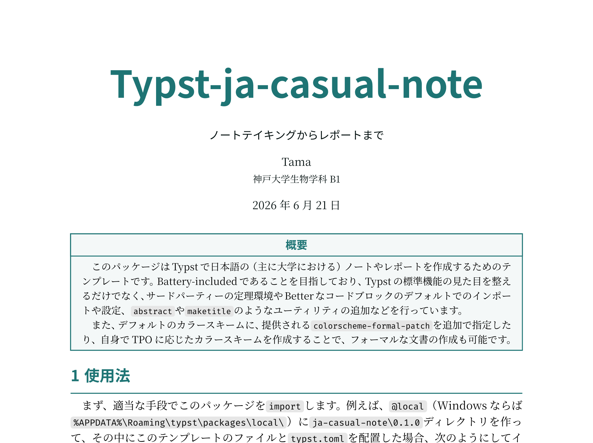

# ja-casual-note
Typstで日本語の（主に大学における）ノートやレポートを作成するためのテンプレート。

## 使い方
現段階では、まだTypst Universeに登録していないため、`local`にインストールする必要があります。Windowsの場合は、`%AppData%\Roaming\typst\packages\local`に、`ja-casual-note\0.1.0`のようなディレクトリを作成し、そこにこのリポジトリの内容をコピーしてください。

より詳細な使い方やユーティリティについては、[こちら](docs.pdf)を参照してください。